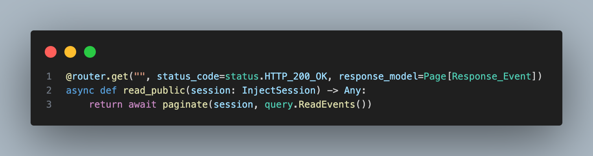

# OOP Coursework (Backend Dibs)

My is a REST API for a startup project named Party Dibs.

(THIS IS A PUBLIC REPO THAT ONLY INCLUDES THE COURSEWORK README FILE)

# Introduction

Party Dibs is a cross-platform application for event voucher management. Its main purpose is to assist event organizers in creating, managing, and tracking promotional codes during events.

Quick introduction to the App Flow:


Backend is built using:

* Programming Language: Python
* Main Frameworks: FastAPI, SQLAlchemy
* Databases: PostgreSQL, Redis

Detailed information regarding local deployment, development, and testing is available in the [README.md](../README.md)

As the application requires some setup before running locally (deploying PostgreSQL and Redis), feel free to try it out in our [development environment](https://backend-dibs.onrender.com/api/docs). (Please note: the application spins down occasionally, so it may take a few seconds to deploy when accessing the link.)

# Body

This section covers all functional requirements of the project and their implementation.

## 1. Use Git and upload your work to Github

The project is hosted on a private GitHub repository to protect the code.


As I am the only only one working on the backend, there is no branching strategy currently in place. However, I have implemented a CI/CD pipeline that deploys the app to Render.com when changes are merged into the main branch.


## 2. The Four OOP Pillars: Meaning and Usage

#### Polymorphism 

Polymorphism allows entities to take on several different forms. For instance, multiple methods can have the same name but different implementations, adding flexibility and simplicity to the coding process.

#### Abstraction 

Sometimes we want to keep our code simple by hiding internal processes from other users. This is called abstraction.
 
I employ abstraction to manage my 'RepositoryInterface', which serves as a class template with unimplemented (abstract) methods.

[](../backend_dibs/domain/interfaces/repository.py)

#### Inheritance 

Inheritance involves creating a new class (child) from an existing class (parent), allowing the child class to inherit its parent's properties. This promotes reusability and models real-world relationships.

A good example of inheritance is seen in the implementation of SQLAlchemy's mapped classes. Each of those classes has a some common fields: id, created_at, updated_ad.

Instead of adding these fields to each class, I create a CustomBaseModel class, which has required fields.

[](../backend_dibs/infrastructure/database/models/base.py)

Now I can inherit from this class and have all its attributes without the need to redefine these fields again.

#### Encapsulation

If we try to limit access to objects data and methods, this is called encapsulation. We need it to prevent code misuse and to ensure its proper functionality.

For example, here is my HashService class:

[](../backend_dibs/infrastructure/auth/hash_service.py)

As you can see I have encapsulated my hashing library methods within the class, preventing misuse and making it easier to swap the library if something appears to be wrong with it.

## 3. Implement at Least Two Design Patterns

#### CQRS

CQRS (Common Querry Responsibility Segregation) is a type of design pattern that mainly focuses on separating the way of reading and writing the data.

If we look closely at my application, we will see that write and read endpoints have completely different implementations.

For example, lets look at one of my write endpoints which adds vouchers to event:

[](../backend_dibs/api/v1/events/routes.py)

In write endpoints such as this one we are injecting a "use case" which handles all of our logic for writing vouchers when excecuted. This lets our endpoints to stay clean and easy to understand.

Now lets take a look at read events endpoint:

[](../backend_dibs/api/v1/events/routes.py)

In this and every other read endpoint we straight up use SQLAlchemys querying, without using our previously mentioned "use case" pattern. 

As querying does not require much logic to be executed (Auth, and other validations are handled by FastAPI), it is pointless to seperate it from endpoint, as it would add a lot of boilerplate code for absolutely no need.

Being pragmatic and having a seperate approach to designing read and write endpoints has helped to write easy to to scale code while keeping it as simple as possible.

#### Repository Pattern

The repository pattern separates the data access logic from the business logic in an application. In our case we want to seperate SQLAlchemy from our domain layer. This way we promote code reusability by making it easier to swap or extend our data management implementations.

Example of user repository: 

[](../backend_dibs/infrastructure/database/repositories/user.py)

Base class for repositories and other repository implementations can be found [here](../backend_dibs/infrastructure/database/repositories/base.py).

## 4. Reading from file & writing to file

Coursework requirements state that I am allowed to use Databases instead of reading and writing files.

My application uses 2 databases:

### PostgreSQL

Used as a main database. For working with PostgreSQL I am using a Python toolkit and ORM [SQLAlchemy](https://www.sqlalchemy.org).

#### Implementation

To connect to the database we pass our postgres dsn and create an engine and a session factory.

[](../backend_dibs/infrastructure/database/main.py)

We make a function that creates a session and yields it for our usage. We will be using this as an injection later based on our needs.

[](../backend_dibs/infrastructure/database/main.py)

We also have to implement our ORM models by inheriting from SQLAlchemy's DeclarativeBase class. 

Firstly we create a our custom base class for more customization:

[](../backend_dibs/infrastructure/database/models/base.py)

Use it to create our models:

[](../backend_dibs/infrastructure/database/models/event.py)

You can find all ORM models [here](../backend_dibs/infrastructure/database/models/).

Finally, I use SQLAlchemy to implement my [RepositoryBase](../backend_dibs/infrastructure/database/repositories/base.py), which takes care of managing the database. For example, querying a model by its unique UUID:


#### Schemas

Schema migrations are managed by [Atlas](https://atlasgo.io/).

Visualization:


### Redis

Used for session management. Implemented using a Python client for redis named [redis-py](https://redis-py.readthedocs.io).

#### Implementation

We create a redis client and implement our RedisService class.

[](../backend_dibs/infrastructure/redis_service.py)

The class is used in [JWTRedisAuthentication](../backend_dibs/infrastructure/auth/main.py) for session management.

## 5. Testing

For testing I am using [Pytest](https://docs.pytest.org/). Due to early stages of development and frequent changes the core parts of the code, I am relying on integration tests, which proved to be super useful without requiring much maintenance.

#### Test flow

To run Integration Tests, we need to deploy test databases. We do it using [Docker](https://www.docker.com/) which has to be installed. 

All tasks are automated by Python task runner [Poe](https://poethepoet.natn.io/). 

In [pyproject.toml](../pyproject.toml) I have declared commands for Poe to deploy temporary Redis and Postgres containers.


Command to run tests:
```sh
poe test
```

Containers are deployed for testing and destroyed after. We get test results and coverage:


#### Pytest

Deployed databases are not enough for our integration tests. We have to prepare them using Pytest fixtures.

Firstly, we create the tables and populate the database with a test user.

[](../tests/integration_tests/conftest.py)


Then we create a client fixture that will return a client which we will use to call our endpoints. (We create one that requires auth and the other not)

[](../tests/integration_tests/conftest.py)


We use them in our tests:

[](../tests/integration_tests/test_event_flow.py)

## 6. Code style 

I am using [Ruff](https://docs.astral.sh/ruff) for linting and a static type checker [mypy](https://mypy-lang.org/).

#### mypy

Configured to strictly enforce types:

[](../backend_dibs/domain/use_cases/utils.py)

#### Autohooks

I have also set up git hooks using [Greenbone Autohooks](https://pypi.org/project/autohooks) to run Ruff and mypy after each commit. This way I am sure that all commited code is in line with the project's style.

# Summary

### Results and challenges

Overall, I am quite happy about how my project is growing. By implementing CQRS and Clean Architecture principles, my code is easy to debug and develop. 

Some of the challenges I faced:

* When applying Clean Architecture principles, I was struggling due to writing a lot of boilerplate code to solve some simple task. This forced me to become more pragmatic and implementent CQRS. Moral - there is no perfect solution for everything.

* Python static typing can be a nightmare. Python was made to be dynamically typed, so enforcing static types with [mypy](https://mypy-lang.org/), even though beneficial in the log run, sometimes can take a lot of time to implement properly. In addition to that some typing features form newer Python versions like ([PEP 695](https://github.com/python/mypy/issues/15238)) are not supported yet.

* No supervision makes you question everything. When developing an app alone and there is no one to review your PRs, all responsibility and pressure is on you.

### Conclusions

I believe I have managed to create a robust backend for our startup. If our POC manages to succeed, our next goal would be to release the app to the public.
